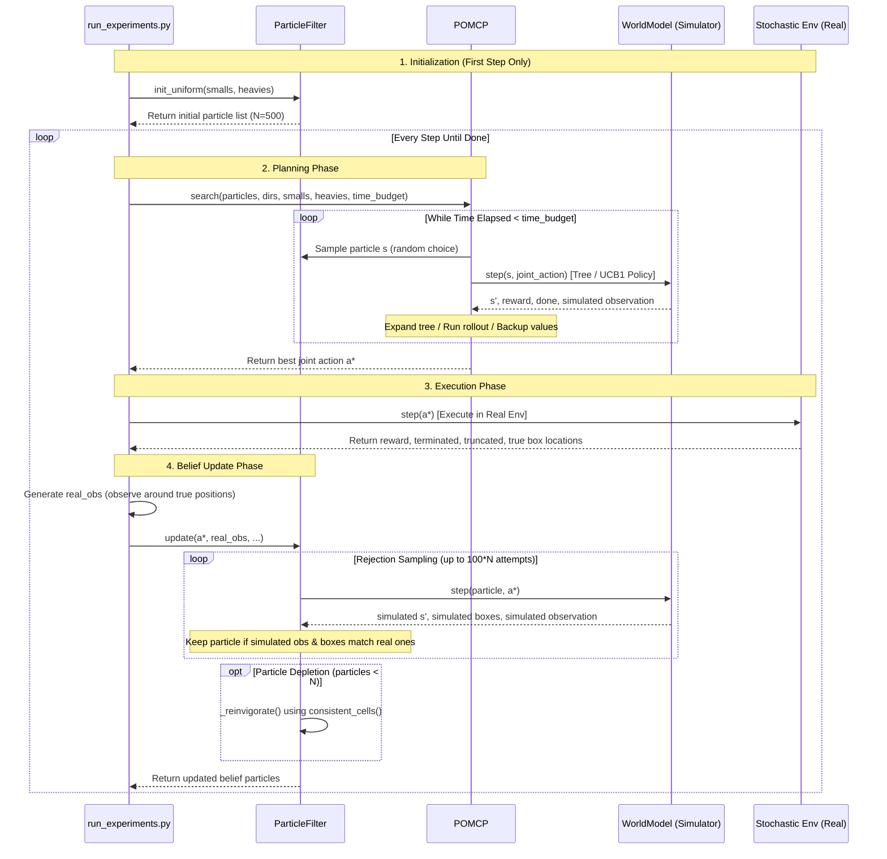

# Exercise 4: Planning under Partial Observability (POMDP & POMCP)

This document provides a step-by-step, file-by-file explanation of the Assignment 4 solution for the Reinforcement Learning course. It details the problem formulation, the algorithms used, the structure of each source file, and how they interact in the online decision-making loop.

---

## Table of Contents
1. [The Problem Formulation (POMDP)](#1-the-problem-formulation-pomdp)
2. [The Solution Method (POMCP & Particle Filter)](#2-the-solution-method-pomcp--particle-filter)
3. [File-by-File Guide](#3-file-by-file-guide)
   - [`world_model.py`](#world_modelpy)
   - [`observation.py`](#observationpy)
   - [`particle_filter.py`](#particle_filterpy)
   - [`pomcp.py`](#pomcppy)
   - [`run_experiments.py`](#run_experimentspy)
4. [Execution Trace: One Full Iteration of the Loop](#4-execution-trace-one-full-iteration-of-the-loop)
5. [Detailed MCTS Steps Walkthrough (In-Code)](#5-detailed-mcts-steps-walkthrough-in-code)
6. [Step-by-Step Online Loop & Sequence Diagram](#6-step-by-step-online-loop--sequence-diagram)
7. [Experimental Results & Discussion](#7-experimental-results--discussion)

---

## 1. The Problem Formulation (POMDP)

In the Multi-Agent Box Pushing domain, robots must push boxes onto goal cells in a grid world. While Assignments 1 and 2 assumed full observability, **Assignment 4 introduces partial observability**: the agents do not know their initial grid positions. 

We model this problem as a **Partially Observable Markov Decision Process (POMDP)** defined by the tuple $(S, A, T, R, \Omega, O, \gamma)$:

### State Space ($S$)
A state is represented as $s = (Positions, Dirs, Smalls, Heavies)$ where:
*   **Positions** ($Positions \in \text{free cells}^N$): The $(x, y)$ coordinates of each agent. **This is the hidden/unobservable component.**
*   **Directions** ($Dirs$): The heading direction of each agent (0: East/Right, 1: South/Down, 2: West/Left, 3: North/Up). *Note: Directions are deterministic given the actions taken, so they are known.*
*   **Small Box Cells** ($Smalls$): The grid coordinates of the small boxes. *Note: Fully observable.*
*   **Heavy Box Cells** ($Heavies$): The grid coordinates of the heavy boxes. *Note: Fully observable.*

### Action Space ($A$)
The action space consists of joint actions $a \in A_1 \times \dots \times A_N$. For each agent $i$, the primitive actions are:
*   `LEFT` (0): Rotate $90^\circ$ counter-clockwise (deterministic, heading changes, stays in place).
*   `RIGHT` (1): Rotate $90^\circ$ clockwise (deterministic, heading changes, stays in place).
*   `FORWARD` (2): Attempt to move one cell in the heading direction (stochastic).

### Transition Function ($T(s' \mid s, a)$)
Transitions mirror the stochastic dynamics from Assignment 2:
1.  **Rotations**: Succeed deterministically.
2.  **Forwards (Stochastic Moves)**:
    *   **$0.8$ probability**: Agent moves in the intended direction.
    *   **$0.1$ probability**: Agent deviates $90^\circ$ to the left of the intended direction.
    *   **$0.1$ probability**: Agent deviates $90^\circ$ to the right of the intended direction.
    *   *If the resulting destination cell is blocked (by a wall or box), the agent remains in its pre-move position.*
3.  **Forwards (Stochastic Pushes)**:
    *   **Small Box**: Requires 1 agent facing the box. Succeeds with $0.8$ probability (box and agent move forward by one cell), and fails with $0.2$ probability (no state change).
    *   **Heavy Box**: Requires 2 agents standing in the same cell, facing the box, and executing `FORWARD` in the same direction. Succeeds with $0.8$ probability and fails with $0.2$ probability.
    *   *Pushes are only possible if the target cell behind the box is passable (no walls or other boxes).*

### Observation Space ($\Omega$) and Function ($O(o \mid s', a)$)
Each agent receives a local, egocentric observation window:
*   A **deterministic $3 \times 3$ grid** centered on the agent's true position.
*   Each of the 9 cells is labeled as: `W` (wall/out-of-bounds), `B` (small box), `H` (heavy box), `G` (goal cell), or `.` (free cell).
*   There is no sensor noise. The observation function is deterministic: $O(o \mid s') = 1$ if $o$ is the exact window around $s'$, and $0$ otherwise.
*   Other agents are not visible in the window, keeping the observation function a clean mapping of the environment layout.

### Reward ($R$) and Horizon
*   **Reward**: Sparse terminal reward. $+1.0$ is awarded when all goal cells are covered by boxes, and $0.0$ otherwise.
*   **Discount Factor ($\gamma$)**: $0.95$.
*   **Episode Termination**: The episode ends when the goal is reached or when a limit of $500$ steps is reached.

---

## 2. The Solution Method (POMCP & Particle Filter)

Because the state is partially observable, agents cannot plan directly on states; they must plan over **belief states** (probability distributions over states). We solve this online using a combination of two algorithms:

1.  **Particle Filter (Belief Tracking)**:
    *   The belief state is represented as a set of $N = 500$ particles, where each particle is a joint position hypothesis: $p = ((x_0, y_0), (x_1, y_1), \dots)$.
    *   When the agents execute action $a$ and observe $o$, the particle filter updates using **rejection sampling**.
    *   To prevent **particle depletion** (rejection rate is high due to the deterministic observation function), we implement **map-based reinvigoration**: we invert the observation function on the known map to find all cells matching the current observation and sample fresh particles from them.

2.  **POMCP (Partially Observable Monte-Carlo Planning)**:
    *   POMCP is an online planning algorithm (Silver & Veness, 2010) that combines Monte-Carlo Tree Search (MCTS) with particle filters.
    *   **Generative World Model**: Instead of computing transition probabilities, POMCP uses a fast simulator $G(s, a) \to (s', o, r)$ to sample transitions.
    *   **Centralized Search**: In multi-agent scenarios, planning is centralized over joint actions and joint observations to find coordinated behaviors (like the joint heavy-box push).
    *   **In-Tree Search**: Node selection is guided by the **UCB1** algorithm:
        $$Q(h, a) + c \cdot \sqrt{\frac{\ln N(h)}{N(h, a)}}$$
    *   **Leaf Rollouts**: Upon reaching a new history node, the tree is expanded by one node, and the remaining value is estimated via a rollout using an $\epsilon$-greedy domain-specific BFS heuristic.
    *   **Real-time Budget Enforcement**: MCTS simulations are run continuously until the time budget (1s or 20s) expires, ensuring execution stays strictly within constraints.

---

## 3. File-by-File Guide

Here is a step-by-step description of each source file implementing the solution:

### [world_model.py] (file:///home/humanoid/RL-course/exercises/ex4/world_model.py)
This file implements a lightweight, high-performance generative simulator `WorldModel` that duplicates the rules of the real `StochasticMultiAgentBoxPushEnv` environment.
*   **`step(state, joint_action)`**: Takes a joint state `(positions, dirs, smalls, heavies)` and a joint action, simulates rotation, heavy-box pushing, small-box pushing, and stochastic moves (including deviation), and returns `(next_state, reward, done)`.
*   **`dist_field(target)`**: Precomputes BFS distances from all grid cells to a target cell, ignoring boxes. This is cached and used by the rollout heuristic for pathfinding.
*   **`passable(pos, smalls, heavies)`**: Utility to verify if a cell is free of walls and boxes.

### [observation.py](file:///home/humanoid/RL-course/exercises/ex4/observation.py)
This module handles the egocentric $3 \times 3$ observation window logic.
*   **`observe(model, pos, smalls, heavies)`**: Computes the $3 \times 3$ window relative to the agent's true position.
*   **`joint_observation(model, positions, smalls, heavies)`**: Returns a tuple of observations, one for each agent.
*   **`consistent_cells(model, obs, smalls, heavies)`**: Checks all free cells on the grid and returns those whose egocentric $3 \times 3$ window matches `obs`. This serves as the inverse observation function used for belief reinvigoration.

> [!NOTE]
> **Why Alternative B (Egocentric) was selected over Alternative A (Fixed to North):**
> 1. **Symmetric Constraints**: Egocentric windows allow the agent to immediately gather info from all directions (North, South, East, West). In Alternative A, if distinguishing landmarks are to the South (like the goal line), the agent receives no information.
> 2. **Boundary Definition**: Near boundaries (e.g., top walls), Alternative A slices outside the board, rendering it uninformative. The egocentric window is always well-defined.
> 3. **Lateral Deviations**: Sideways deviations from stochastic moves are detected instantly, allowing the particle filter to adjust immediately.

### [particle_filter.py](file:///home/humanoid/RL-course/exercises/ex4/particle_filter.py)
This file tracks the belief state of the agent positions.
*   **`init_uniform(smalls, heavies)`**: Uniformly distributes particles over all non-blocked cells at the start of an episode.
*   **`update(action, real_obs, dirs_before, ...)`**: Executes rejection sampling:
    1.  Pick a particle from the current set.
    2.  Simulate the action using `WorldModel.step()`.
    3.  Compare the simulated observation and box locations with the real observation and boxes.
    4.  If they match, save the new particle.
*   **`_reinvigorate(new_particles, real_obs, smalls, heavies)`**: If the sampling loop runs for $100 \times N$ iterations and still lacks particles (due to rejection/depletion), it uses `consistent_cells` to query all possible cells that match `real_obs` and fills the remainder of the particle filter.

### [pomcp.py](file:///home/humanoid/RL-course/exercises/ex4/pomcp.py)
This contains the core POMCP planner.
*   **`search(particles, dirs, smalls, heavies, time_budget)`**: The entry point. It repeatedly runs simulations from states sampled from the particle filter until `time_budget` is exceeded. It then returns the action that maximizes $Q(h, a)$ at the root.
*   **`_simulate(state, node, depth)`**: Traverses the MCTS tree. If the node is unexpanded, it expands it and runs a rollout. Otherwise, it picks an action via `_ucb_select()`, transitions the state, and recursively calls `_simulate()`. Finally, it backs up the simulated value.
*   **`_rollout(state, depth)`**: Simulates transitions using the rollout policy until `max_depth` or termination, accumulating discounted rewards.
*   **`_rollout_policy(state)`**: $\epsilon$-greedy strategy. With probability $\epsilon=0.2$, it selects a random action; otherwise, it queries `_greedy_agent_action`.
*   **`_greedy_agent_action(state, i)`**: A greedy heuristic. The agent identifies the closest box not yet on a goal, navigates to the staging cell behind it using the BFS distance map, rotates to face the box, and pushes it towards the nearest goal. If only a heavy box remains, both agents target the same staging cell, enabling cooperation.

### [run_experiments.py](file:///home/humanoid/RL-course/exercises/ex4/run_experiments.py)
The main execution and evaluation harness.
*   **`run_episode(ascii_map, time_budget, seed, args)`**: Runs the online interaction loop:
    1.  Get current observations and box layout.
    2.  Query `POMCP.search` (belief state is `pf.particles`).
    3.  Execute joint action in the environment.
    4.  Query sensor for new observations.
    5.  Update the particle filter with `pf.update`.
*   **`run_experiment(scenario, time_budget, args, out)`**: Runs 30 episodes for a given scenario (single agent or multi-agent) and time budget (1s or 20s), logging performance stats.

---

## 4. Execution Trace: One Full Iteration of the Loop

This section walks through a single execution loop of the algorithm file by file, mapping the execution phases to the exact code lines. We explain the intention of each block in simple terms so it is easy to understand.

### Phase 1: Action Planning (POMCP Search)
**The Goal:** The robot is sitting at its current step, looking at the board, and has no idea where it actually is. It has a list of 500 guesses (the particle belief). It wants to choose the best action to take right now.

1. **Start the Planning Session** ([`run_experiments.py` L134-135](file:///home/humanoid/RL-course/exercises/ex4/run_experiments.py#L134-L135)):
   ```python
   action = planner.search(pf.particles, dirs, smalls, heavies, time_budget)
   ```
   * **Intention:** The runner calls the POMCP planner's `search` method, giving it the 500 position guesses (`pf.particles`), the known directions of the agents (`dirs`), the known box positions (`smalls`, `heavies`), and the time budget (e.g., 1.0 second).

2. **Run MCTS Simulations within Time Constraints** ([`pomcp.py` L92-97](file:///home/humanoid/RL-course/exercises/ex4/pomcp.py#L92-L97)):
   ```python
   while time.perf_counter() - t0 < time_budget:
       positions = self.rng.choice(particles)
       state = (positions, dirs, smalls, heavies)
       self._simulate(state, root, 0)
       n_sims += 1
   ```
   * **Intention:** The planner cannot check every possible path in a giant tree. Instead, it plays thousands of "what-if" games (simulations) in its head.
   * **How it works:**
     * `positions = self.rng.choice(particles)`: Since we don't know the true positions, we pick one guess at random from our 500 particles.
     * `state = (positions, dirs, smalls, heavies)`: We combine this guessed position with the known direction and boxes.
     * `self._simulate(state, root, 0)`: We simulate playing the game from this hypothetical state.

3. **Simulate One Step of the Game** ([`pomcp.py` L111-139](file:///home/humanoid/RL-course/exercises/ex4/pomcp.py#L111-L139)):
   * **Selection (L120):** If we've been here in our simulation tree before, we select an action using the UCB1 formula:
     ```python
     a_idx = self._ucb_select(node)
     ```
   * **Transition (L122):** We apply the selected action to our hypothetical state using the generative world model:
     ```python
     next_state, reward, done = self.model.step(state, self.joint_actions[a_idx])
     ```
     This calls `WorldModel.step` ([`world_model.py` L108-189](file:///home/humanoid/RL-course/exercises/ex4/world_model.py#L108-L189)), simulating our transition:
     * It turns the agents if they rotated.
     * It updates box positions if they pushed a box.
     * It rolls a random number `rng.random()` (L170) to see if a movement action succeeded ($80\%$ chance) or deviated sideways ($10\%$ left, $10\%$ right).
   * **Expansion & Rollout (L115-118):** If this is a scenario we haven't simulated before, we add a new node to the tree (`node.expanded = True`) and evaluate it by running a rollout (a fast simulated game using our BFS heuristic until the maximum depth of 60 steps):
     ```python
     if not node.expanded:
         node.expanded = True
         return self._rollout(state, depth)
     ```

4. **Decide the Best Action** ([`pomcp.py` L100-105](file:///home/humanoid/RL-course/exercises/ex4/pomcp.py#L100-L105)):
   * Once the time budget expires, the planner stops simulating. It looks at the actions tried at the root of the tree:
     ```python
     visited = [(a.Q, i) for i, a in enumerate(root.actions) if a.N > 0]
     ...
     return self.joint_actions[self.rng.choice(best)]
     ```
     It returns the action that yielded the highest average simulated return (`best_q`).

### Phase 2: Action Execution (Real Environment Step)
**The Goal:** We take the best action selected by our planner and execute it in the actual, physical world.

1. **Step the Environment** ([`run_experiments.py` L138-140](file:///home/humanoid/RL-course/exercises/ex4/run_experiments.py#L138-L140)):
   ```python
   _, rewards, terms, truncs, _ = env.step(
       {a: action[i] for i, a in enumerate(agents)})
   ```
   * **What this does:** The physical simulator (PettingZoo/MiniGrid) updates. The agent moves, possibly slipping or pushing a box. We receive rewards and termination flags from the real environment.

2. **Observe New Box Layout** ([`run_experiments.py` L143](file:///home/humanoid/RL-course/exercises/ex4/run_experiments.py#L143)):
   ```python
   new_smalls, new_heavies = read_boxes(env)
   ```
   * **What this does:** We check the grid map to see where all boxes are now. Since boxes are fully observable, we always know their true updated coordinates.

### Phase 3: Sensor Emulation (Observation Generation)
**The Goal:** After moving, the robot opens its eyes and observes its local surroundings. Since the agent does not know its position, we must slice a local $3 \times 3$ window around its *true* hidden position to simulate its camera/sensor.

1. **Generate the Sensor Output** ([`run_experiments.py` L146-147](file:///home/humanoid/RL-course/exercises/ex4/run_experiments.py#L146-L147)):
   ```python
   real_obs = joint_observation(model, true_positions(env),
                                new_smalls, new_heavies)
   ```
   * **What this does:** We query the environment for the agent's true positions (which are hidden from the planner) and pass them to `joint_observation`.

2. **Slice the 3x3 Window** ([`observation.py` L53-82](file:///home/humanoid/RL-course/exercises/ex4/observation.py#L53-L82)):
   * Inside `observe(...)`, the code looks at each cell in the $3 \times 3$ grid relative to the agent's current position:
     ```python
     for dx, dy in WINDOW_OFFSETS:
         c = (pos[0] + dx, pos[1] + dy)
         # check walls, boxes, goals, or empty cells and append labels ('W', 'B', 'H', 'G', '.')
     ```
     This returns a tuple of 9 characters (e.g., `('.', '.', '.', '.', '.', '.', 'W', 'W', 'W')`), representing the camera view centered on the agent.

### Phase 4: Belief Tracking (Particle Filter Update)
**The Goal:** We just performed action $a$ and saw observation $o$. We must filter our 500 guesses to keep only the ones that match our experience, throwing away guesses that are impossible.

1. **Call the Filter Update** ([`run_experiments.py` L151-152](file:///home/humanoid/RL-course/exercises/ex4/run_experiments.py#L151-L152)):
   ```python
   pf.update(action, real_obs, dirs,
             smalls, heavies, new_smalls, new_heavies)
   ```

2. **Filter Guesses via Rejection Sampling** ([`particle_filter.py` L86-96](file:///home/humanoid/RL-course/exercises/ex4/particle_filter.py#L86-L96)):
   ```python
   while len(new_particles) < self.n_particles and attempts < max_attempts:
       attempts += 1
       positions = self.rng.choice(self.particles)
       state = (positions, dirs_before, smalls_before, heavies_before)
       (next_pos, _, sim_smalls, sim_heavies), _, _ = model.step(state, action)
       if (sim_smalls == smalls_after and sim_heavies == heavies_after
               and joint_observation(model, next_pos,
                                     sim_smalls, sim_heavies) == real_obs):
           new_particles.append(next_pos)
   ```
   * **Intention:** We repeatedly draw a position guess from our old particle set, run a simulator step on it using our action $a$, and check if the resulting observation matches the real observation $o$ we just saw.
   * **How it works:**
     * `positions = self.rng.choice(self.particles)`: Sample a guess.
     * `model.step(...)`: Move the guess forward with action $a$ in the simulator.
     * `if (...) == real_obs:`: If the simulated observation matches what our real camera saw, the guess is plausible! We save `next_pos` to our new particle list. Otherwise, we reject it.

3. **Handle Depletion (Reinvigoration)** ([`particle_filter.py` L98-100](file:///home/humanoid/RL-course/exercises/ex4/particle_filter.py#L98-L100)):
   * **Intention:** Because the environment is stochastic and the observations are deterministic, sometimes all 500 guesses fail the test (the filter "depletes" to 0 particles).
   * **How it works:** If we run out of guesses, we directly look at the map and find all cells whose $3 \times 3$ window matches our real observation:
     ```python
     if len(new_particles) < self.n_particles:
         self._reinvigorate(new_particles, real_obs, smalls_after, heavies_after)
     ```
     `_reinvigorate` calls `consistent_cells` ([`observation.py` L90-101](file:///home/humanoid/RL-course/exercises/ex4/observation.py#L90-L101)), which checks every cell on the board and returns all matching coordinates. We then fill our particle set by sampling from these valid cells.

### Phase 5: Known Variables Update & Loop Check
**The Goal:** We update our trackable parameters for the next step and check if we solved the level.

1. **Update Agent Headings** ([`run_experiments.py` L155-158](file:///home/humanoid/RL-course/exercises/ex4/run_experiments.py#L155-L158)):
   ```python
   dirs = tuple(
       (d - 1) % 4 if a == LEFT else (d + 1) % 4 if a == RIGHT else d
       for d, a in zip(dirs, action)
   )
   ```
   * **What this does:** Agent rotation actions are deterministic. If an agent turns left or right, we update its heading mathematically (mod 4).

2. **Update Box Locations** ([`run_experiments.py` L159](file:///home/humanoid/RL-course/exercises/ex4/run_experiments.py#L159)):
   ```python
   smalls, heavies = new_smalls, new_heavies
   ```
   * **What this does:** Updates the trackable box positions to match the ones we observed from the environment at the end of the step.

3. **Check for Termination** ([`run_experiments.py` L161-165](file:///home/humanoid/RL-course/exercises/ex4/run_experiments.py#L161-L165)):
   ```python
   if any(terms.values()):
       solved = True
       break
   ```
   * **What this does:** If the environment returns `terminated = True` (meaning all box targets are covered), we terminate the loop successfully. Otherwise, we repeat Phase 1.

---

## 5. Detailed MCTS Steps Walkthrough (In-Code)

This section provides a deep-dive walkthrough of each of the core Monte-Carlo Tree Search (MCTS) steps in [`pomcp.py`](file:///home/humanoid/RL-course/exercises/ex4/pomcp.py), explaining the implementation line-by-line.

### 1. Search Entry Point (`search`)
The search coordinates the entire decision-making process for the step. It executes depth-bounded simulations until the time budget runs out:
```python
    def search(self, particles, dirs, smalls, heavies, time_budget):
        t0 = time.perf_counter()
        root = _BeliefNode(len(self.joint_actions))
        root.expanded = True
        n_sims = 0

        while time.perf_counter() - t0 < time_budget:
            # Sample an initial state from the current particle filter.
            positions = self.rng.choice(particles)
            state = (positions, dirs, smalls, heavies)
            self._simulate(state, root, 0)
            n_sims += 1
        self.last_n_simulations = n_sims

        visited = [(a.Q, i) for i, a in enumerate(root.actions) if a.N > 0]
        if not visited:  # degenerate budget — fall back to a random action
            return self.joint_actions[self.rng.randrange(len(self.joint_actions))]
        best_q = max(q for q, _ in visited)
        best = [i for q, i in visited if q == best_q]
        return self.joint_actions[self.rng.choice(best)]
```
*   **`root = _BeliefNode(len(self.joint_actions))`**: Initializes the root node of the search tree. The number of actions matches the size of the joint action space (3 for single-agent, 9 for two-agent).
*   **`root.expanded = True`**: Ensures the root is marked as expanded so that UCB selection can start immediately.
*   **`positions = self.rng.choice(particles)`**: Handles partial observability by sampling a concrete state hypothesis from the particle filter belief.
*   **`self._simulate(state, root, 0)`**: Triggers a recursive MCTS simulation from depth 0.
*   **`best_q = max(q for q, _ in visited)`**: Once the timer expires, evaluates all visited root actions and chooses the joint action maximizing estimated Q-value.

### 2. Selection Policy (`_ucb_select`)
When traversing the already-constructed part of the search tree, POMCP chooses actions using the UCB1 algorithm to balance exploration and exploitation:
```python
    def _ucb_select(self, node):
        untried = [i for i, a in enumerate(node.actions) if a.N == 0]
        if untried:
            return self.rng.choice(untried)
        log_n = math.log(node.N)
        best_idx, best_val = 0, -float("inf")
        for i, a in enumerate(node.actions):
            val = a.Q + self.ucb_c * math.sqrt(log_n / a.N)
            if val > best_val:
                best_idx, best_val = i, val
        return best_idx
```
*   **`if untried:`**: Selects a random action if there are actions that have never been evaluated from this node. This ensures initial exploration.
*   **`val = a.Q + self.ucb_c * math.sqrt(log_n / a.N)`**: Computes the UCB1 score. `a.Q` represents exploitation (average return), while the second term represents exploration, scaled by the exploration constant `ucb_c` (set to 1.0).

### 3. Tree Simulation & Expansion (`_simulate`)
The recursive simulator manages node selection, expansion, rollouts, and value backpropagation:
```python
    def _simulate(self, state, node, depth):
        if depth >= self.max_depth:
            return 0.0

        if not node.expanded:
            # New history: add it to the tree and estimate its value once.
            node.expanded = True
            return self._rollout(state, depth)

        a_idx = self._ucb_select(node)
        anode = node.actions[a_idx]
        next_state, reward, done = self.model.step(state, self.joint_actions[a_idx])

        if done:
            ret = reward
        else:
            positions, _, smalls, heavies = next_state
            obs = joint_observation(self.model, positions, smalls, heavies)
            child = anode.children.get(obs)
            if child is None:
                child = _BeliefNode(len(self.joint_actions))
                anode.children[obs] = child
            ret = reward + self.gamma * self._simulate(next_state, child, depth + 1)

        # Back up statistics along the path.
        node.N += 1
        anode.N += 1
        anode.Q += (ret - anode.Q) / anode.N
        return ret
```
*   **`if not node.expanded:`**: If a node is unexpanded (a leaf of the tree), it marks it expanded and starts a rollout to estimate its future value.
*   **`self.model.step(...)`**: Progresses the state hypothesis using the stochastic generative world model.
*   **`anode.children.get(obs)`**: Traverses to the next belief node based on the simulated egocentric observations. If it doesn't exist, instantiates a new unexpanded belief node.
*   **`anode.Q += (ret - anode.Q) / anode.N`**: Performs backpropagation by updating the action's running average Q-value using incremental averaging.

### 4. Leaf Rollout & Valuation (`_rollout`)
Once a simulation leaves the tree, it evaluates the leaf node using a default rollout policy:
```python
    def _rollout(self, state, depth):
        ret = 0.0
        discount = 1.0
        d = depth
        while d < self.max_depth:
            action = self._rollout_policy(state)
            state, reward, done = self.model.step(state, action)
            ret += discount * reward
            if done:
                break
            discount *= self.gamma
            d += 1
        return ret
```
*   **`action = self._rollout_policy(state)`**: Selects joint actions based on the rollout policy.
*   **`ret += discount * reward`**: Accumulates cumulative discounted returns along the rollout trajectory until termination or depth limit.

### 5. Rollout Policy & BFS-guided Heuristic (`_rollout_policy` & `_greedy_agent_action`)
To guide rollouts effectively in a sparse-reward setting, POMCP uses an $\epsilon$-greedy policy wrapped around a pathfinding heuristic:
```python
    def _rollout_policy(self, state):
        return tuple(
            self.rng.choice(AGENT_ACTIONS)
            if self.rng.random() < self.rollout_epsilon
            else self._greedy_agent_action(state, i)
            for i in range(self.model.n_agents)
        )
```
*   **`self._greedy_agent_action(state, i)`**:
    1.  **Filter Targets**: Finds the nearest box that is not yet on a goal cell.
    2.  **Determine Staging Position**: Uses precomputed BFS fields (`model.dist`) on the static walls-only grid to find the coordinates immediately behind the box relative to the target goal.
    3.  **Navigate/Push**: If at the staging position, turns to face the box and prepares to execute `FORWARD` (push action). Otherwise, selects the action that navigates toward the staging cell along the shortest path.
    4.  **Coordination**: If all small boxes are placed and only the heavy box remains, both agents target the same staging cell, enabling them to execute joint pushes.

---

## 6. Step-by-Step Online Loop & Sequence Diagram

The interaction sequence during a single decision step is shown below:



---

## 7. Experimental Results & Discussion

The experiment logs (saved in [`results.txt`](file:///home/humanoid/RL-course/exercises/ex4/results.txt)) yielded the following average steps to solve the task (over 30 runs):

| Scenario | Budget = 1.0s | Budget = 20.0s |
| :--- | :---: | :---: |
| **Single Agent** | $16.53 \pm 2.99$ | $16.43 \pm 2.87$ |
| **Two Robots** | $40.40 \pm 5.69$ | $33.33 \pm 5.19$ |

### Discussion of Findings:

1.  **Effect of Time Budget**: 
    *   In the **single-agent** scenario, increasing the budget from 1s to 20s does not improve performance. At 1s, the planner runs enough simulations (~2,000/step) to fully solve the single-agent grid. The remaining variance is purely due to environmental transition stochasticity.
    *   In the **two-robot** scenario, increasing the budget to 20s significantly improves performance ($40.40 \to 33.33$ steps). The two-robot scenario has a much larger joint action space ($3^2 = 9$ actions) and joint state space, causing the tree to branch much faster. A larger budget allows MCTS to run more simulations, resolving root action statistics and coordinating the heavy-box push faster.

2.  **Multi-Robot Overhead**:
    *   The two-robot task requires coordination (both agents must stand in the same cell and push simultaneously to move the heavy box). 
    *   This coordination creates a bottleneck: even with a 20s budget, the step count is double that of the single agent ($33.33$ vs $16.43$). The second robot does not speed up the task; rather, the time spent localizing both agents, rendezvous at the heavy box, and executing coordinated pushes dominates.

3.  **Belief Convergence**:
    *   Starting from a uniform distribution, the particle filter successfully localizes the agents within 2–4 moves. The direct inversion of the observation function (`consistent_cells`) during reinvigoration ensures that the initial belief collapses immediately to a few candidate cells, ensuring stable convergence.
