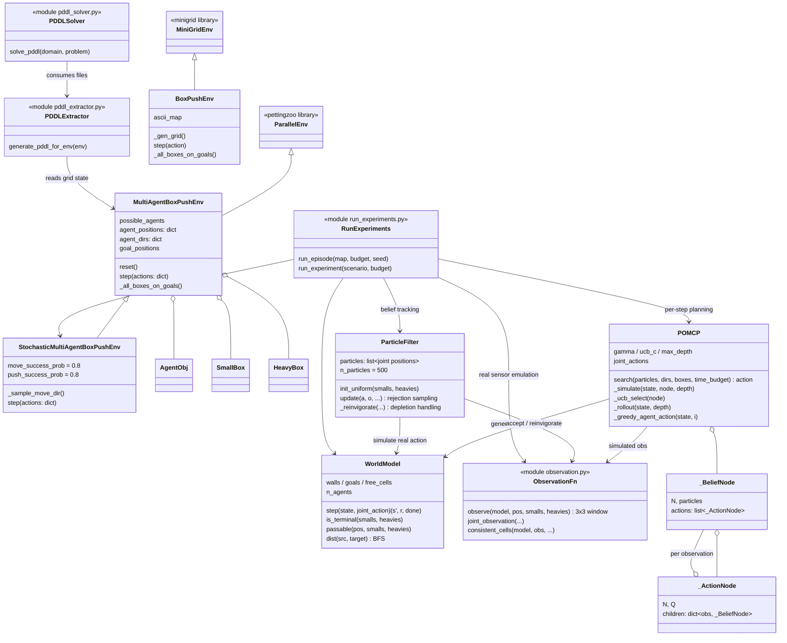
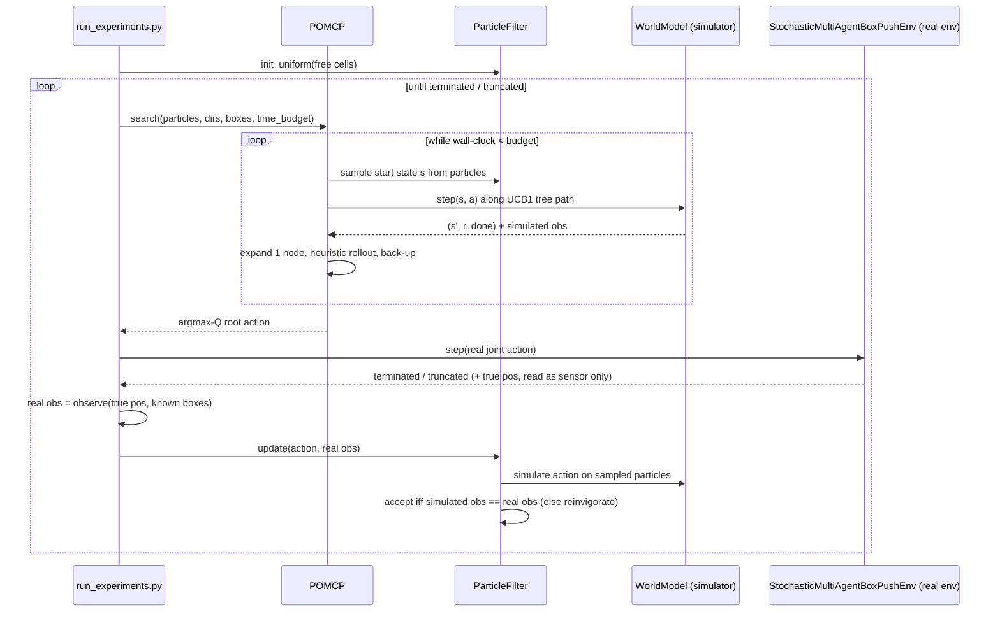

# Project Overview — RL Course: Multi-Agent Box Pushing (with Assignment 4 solution)

This document maps the whole repository: the architecture (UML), what every
file does, and how to run everything — with a focus on the Assignment 4
(POMDP + POMCP) solution in `exercises/ex4/`.

---

## 1. Big picture

The repository implements a grid-world **Box Pushing** domain on top of
MiniGrid / PettingZoo. Robots push small boxes alone (and one heavy box in
pairs) onto goal cells. Across the assignments the problem gets harder:

| Assignment | Setting | Solved with |
|---|---|---|
| ex1 | Deterministic, fully observable | Classical planning (PDDL + Fast Downward) |
| ex2 | **Stochastic** transitions, fully observable | Online replanning + Modified Policy Iteration |
| ex4 | Stochastic transitions + **unknown own position** (POMDP) | **POMCP** over a particle-filter belief (this solution) |

---

## 2. UML — class diagram



## 3. UML — Assignment 4 online-planning loop (sequence)



---

## 4. File-by-file guide

### Root

| File | What it does |
|---|---|
| `README.md` | Course intro, environment setup, branch/submission conventions (ex1 instructions) |
| `CLAUDE.md` | Instructions for AI agents working on this repo |
| `requirements.txt` | Python dependencies (minigrid, pettingzoo, pygame, unified-planning, fast-downward…) |
| `visualize_plan.py` | End-to-end demo: build PDDL from a map → solve with Fast Downward → play the plan in a pygame window. Also exports helpers (`extract_target_pos`, `get_required_actions`) used by ex2 |

### `environment/` — the simulators

| File | What it does |
|---|---|
| `objects.py` | `SmallBox` (pushable by one agent) and `HeavyBox` (needs two agents pushing together) grid objects |
| `box_push_env.py` | `BoxPushEnv` — simple single-agent Gym/MiniGrid env built from an ASCII map (early exercises) |
| `multi_agent_env.py` | `MultiAgentBoxPushEnv` — the main PettingZoo ParallelEnv: joint stepping, small-box pushes, coordinated same-cell heavy-box pushes, rendering; termination when **all** goals are covered by boxes |
| `stochastic_env.py` | `StochasticMultiAgentBoxPushEnv` — same env with the Assignment-2 noise model: move 0.8/0.1/0.1 (side deviations), push 0.8/0.2. **This is the real environment used in ex4** |
| `wrappers.py` | Optional difficulty wrappers (stochastic actions, noisy observations) for earlier exercises |
| `pddl_extractor.py` | Serializes a live env state into `pddl/domain.pddl` + `pddl/problem.pddl` (classical planning bridge) |

### `planner/` + `pddl/`

| File | What it does |
|---|---|
| `planner/pddl_solver.py` | Runs Fast Downward via `unified-planning` on the generated PDDL files, returns the plan |
| `pddl/domain.pddl`, `pddl/problem.pddl` | Latest generated PDDL files |

### `tests/`

Pytest suite for the environments and PDDL pipeline (`test_environment.py`,
`test_multi_agent_env.py`, `test_stochastic_env.py`, `test_joint_push.py`,
`test_single_push.py`, `test_pddl.py`, `test_objects.py`, `test_wrappers.py`).

### `exercises/` — the assignments

| File | What it does |
|---|---|
| `ex2/solution_ex2.py`, `ex2/README.md` | Assignment 2: online replanning + Modified Policy Iteration on the stochastic env |
| `ex4/מטלת_תכנות_4_...pdf` | Assignment 4 statement (Hebrew): POMDP + POMCP |
| **`ex4/world_model.py`** | Fast generative model `G(s,a) → (s′,r,done)` that mirrors the stochastic env exactly (verified empirically), plus BFS distance fields. State = (positions, dirs, smalls, heavies); only positions are hidden |
| **`ex4/observation.py`** | **Deliverable 1** — deterministic egocentric 3×3 observation function (Alternative B), sliced from the fully-known board around the true position; includes `consistent_cells` (inverse of the observation function) for depletion handling |
| **`ex4/particle_filter.py`** | **Deliverable 2** — belief state as N=500 particles (joint position hypotheses); uniform init over free cells; rejection-sampling update per Silver & Veness (2010); capped attempts + map-based reinvigoration against particle depletion |
| **`ex4/pomcp.py`** | **Deliverable 3** — POMCP: MCTS directly over particles, UCB1 in-tree, one-node expansion, ε-greedy BFS-heuristic rollouts to a fixed horizon, value back-up, **time budget enforced inside the search loop**; joint (9-way) actions in the two-robot scenario |
| **`ex4/run_experiments.py`** | The assignment's online-planning loop (plan → act → observe → belief update) + experiment protocol: {single, multi} × {1s, 20s} × 30 runs → mean ± std steps |
| `ex4/README.md` | The assignment report: design choices, hyper-parameters, results table, discussion |
| `ex4/results.txt` | Raw experiment logs (appended by `run_experiments.py`) |
| `ex4/PROJECT_OVERVIEW.md` | This document |

---

## 5. How to run

### One-time setup

```bash
cd RL-course
python3 -m venv .venv
source .venv/bin/activate
pip install -r requirements.txt
```

> Two virtualenvs exist in the working copy; `.venv` (Python 3.9) is the one
> with `minigrid`/`pettingzoo` installed. Any env satisfying
> `requirements.txt` works.

### Assignment 4 — POMCP experiments

```bash
# Full assignment protocol: both scenarios × budgets (1s, 20s) × 30 runs
python3 exercises/ex4/run_experiments.py

# Only the 1-second-budget experiments (≈ 1 hour total):
python3 exercises/ex4/run_experiments.py --budgets 1 --n-runs 30

# Only the 20-second-budget experiments (long — run overnight):
python3 exercises/ex4/run_experiments.py --budgets 20 --n-runs 30

# One scenario / quick sanity check:
python3 exercises/ex4/run_experiments.py --scenarios single --budgets 0.1 --n-runs 3
```

Useful flags: `--n-particles` (default 500), `--ucb-c` (1.0), `--max-depth`
(60), `--gamma` (0.95), `--max-steps` (500), `--seed` (0),
`--results-file` (default `exercises/ex4/results.txt`, appended live).

Results (per-run steps + summary mean/std table) are printed to the terminal
and appended to `exercises/ex4/results.txt`.

### Classical planning demo (ex1 pipeline)

```bash
python3 visualize_plan.py     # PDDL → Fast Downward → pygame playback
```

### Assignment 2 solution

```bash
python3 exercises/ex2/solution_ex2.py
```

### Tests

```bash
python3 -m pytest tests/
```
